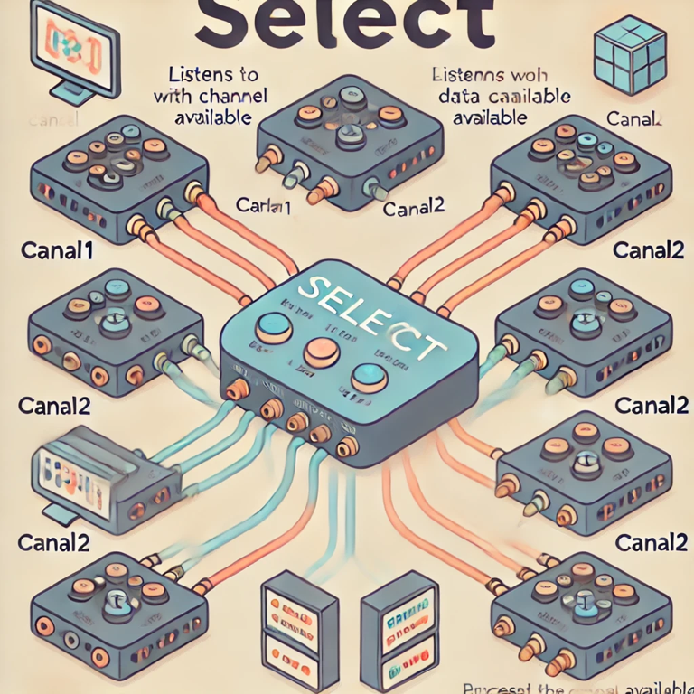
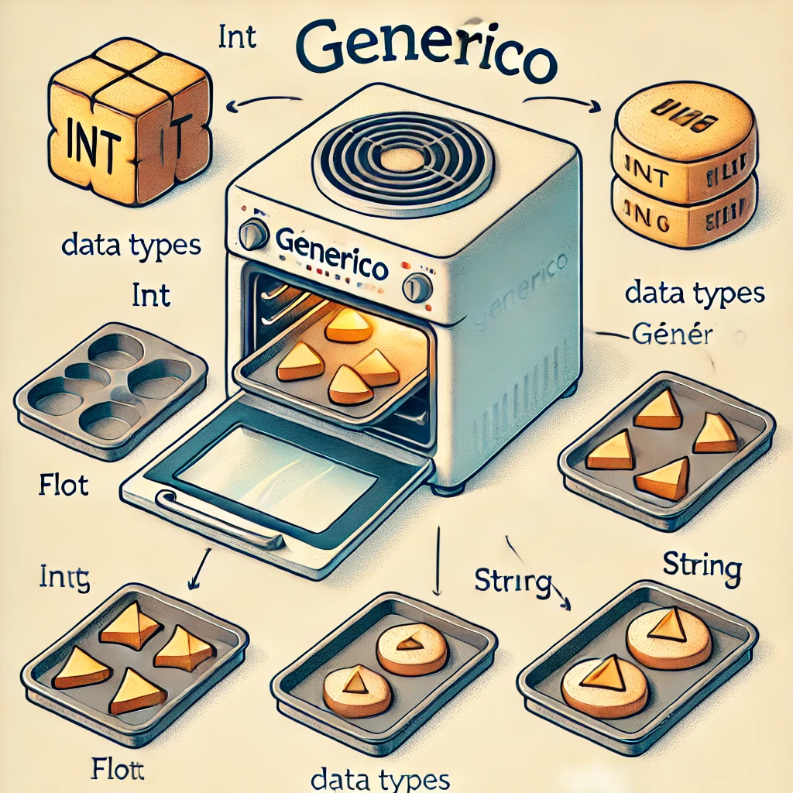
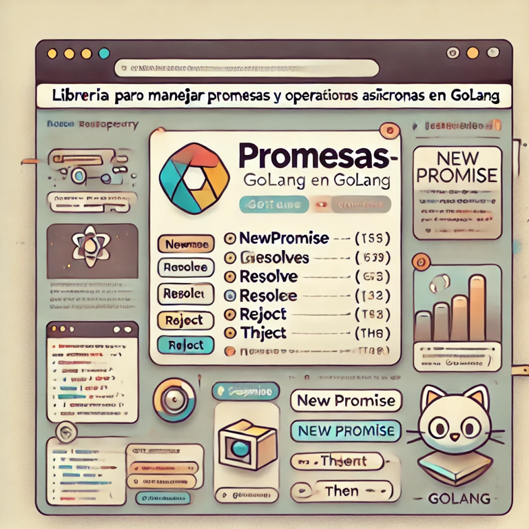

# Creando promesas con `Goroutines`

<p align="center">
  
</p>

## Objetivo del Taller

Este taller tiene como objetivo capacitar a los participantes en el uso avanzado de goroutines, canales y generics en
Go, con el fin de desarrollar aplicaciones concurrentes robustas y flexibles. A lo largo del taller, aprenderán a
combinar estos conceptos de forma efectiva. Al finalizar, cada participante contará con las habilidades necesarias para
construir librerías en Go que aprovechen al máximo sus capacidades de concurrencia y asincronía, escribiendo código
modular y reusable mediante el uso de generics.

## Tabla de Contenido

- [Marco Teórico](#marco-teórico)
    - [Goroutines y Canales](#goroutines-y-canales)
        - [Select](#select)
            - [Timeout](#timeout)
            - [Cancelación](#cancelación)
    - [Generics](#generics)
        - [Restricciones](#restricciones)
    - [Ejercicio](#ejercicio)
        - [Cancelar una Solicitud HTTP con Timeout](#cancelar-una-solicitud-http-con-timeout)
            - [Instrucciones](#instrucciones)
            - [Solución](#solución)
    - [Practiquemos más 🤓](#practiquemos-más-)

## Marco Teórico

### Goroutines y Canales

Como se estudio en [go-concurrency-workshop](https://github.com/marlonbarreto-git/go-concurrency-workshop) las
goroutines son funciones que se ejecutan de forma concurrente y los canales son una forma de comunicación entre
goroutines.

#### Select



El `select` es una estructura de control que permite que un programa espere en múltiples canales y seleccione la primera
operación disponible para continuar su ejecución. Es útil para implementar timeouts, cancelaciones y otras operaciones.

Es una forma eficaz de coordinar canales y manejar la asincronía sin bloquear el programa o complicarlo con estructuras
condicionales.

```go
package main

func main() {
	channel1 := make(chan int)
	channel2 := make(chan int)

	select {
	case val := <-channel1:
		// Operación cuando channel1 recibe un valor
	case channel2 <- 123:
	// Operación cuando se envía un valor a ch2
	default:
		// Operación cuando ninguno de los canales está listo
	}
}

```

##### Funcionamiento:


1. Go evalúa todas las operaciones de canal listadas en cada case de select.
2. Si más de una operación de canal está lista, select elige una aleatoriamente para evitar bloqueos innecesarios.
3. Si ninguna operación está lista y existe un caso default, este se ejecuta inmediatamente, evitando el bloqueo.
4. Si no hay default, la goroutine se bloquea hasta que alguna de las operaciones esté disponible.

Usualmente se utiliza en conjunto con un ciclo `for {}` _(forever)_ para mantener la ejecución de la goroutine y poder
evaluar los canales en cada iteración.

##### Timeout

Uno de los usos más comunes de `select` es implementar timeouts en las operaciones de canal. Por ejemplo, si se desea
esperar un valor de un canal por un tiempo determinado, se puede usar `time.After` para enviar un valor a un canal
después de un tiempo específico.

```go
package main

import (
	"fmt"
	"time"
)

func main() {
	channel := make(chan int)

	select {
	case <-channel:
		fmt.Println("Received")
	case <-time.After(1 * time.Second):
		fmt.Println("Timeout")
	}
}

```

##### Cancelación

Otro uso común de `select` es implementar cancelaciones en operaciones de canal. Por ejemplo, si se desea cancelar una
operación de canal a través de la cancelación de un contexto, se puede usar `context.Done` para recibir una señal de
cancelación.

```go
package main

import (
	"context"
	"fmt"
	"time"
)

func main() {
	channel := make(chan int)
	ctx, cancel := context.WithDeadline(context.Background(), time.Now().Add(1*time.Second))

	select {
	case <-channel:
		fmt.Println("Received")
	case <-ctx.Done():
		defer cancel()
		fmt.Println("Cancelled")
	}
}

```

### Generics



Los generics en Go permiten escribir funciones y estructuras de datos que funcionan con diferentes tipos sin duplicar el
código para cada tipo específico. En lugar de escribir una función para `int` y otra para `float`, por ejemplo, puedes
usar generics para escribir una sola función que sirva para ambos.

Con los generics, puedes crear una función o estructura _“genérica”_ que acepte un tipo de dato **flexible**, indicado
como un parámetro de tipo. Este parámetro puede representar cualquier tipo de datos compatible, como números, cadenas, o
incluso estructuras.

```go
package main

import "fmt"

func MyPrint[T any](value T) {
	fmt.Println(">>> ", value)
}

func main() {
	MyPrint(123)             // >>> 123
	MyPrint("Hello, World!") // >>> Hello, World!
}
```

- `T` es el parámetro de tipo que representa cualquier tipo de dato.
- `any` es una restricción que indica que `T` puede ser cualquier tipo de dato.

#### Restricciones

Algunas de las restricciones más comunes son:

- `any` -> Cualquier tipo de dato.
- `comparable` -> Tipos de datos que pueden ser comparados con `==` y `!=`.
- `int`, `float64`, `string`, etc. -> Tipos de datos específicos.

Sin embargo los generics en Go también permiten definir restricciones sobre los tipos de datos que pueden ser utilizados
en una función, struct, o interface, mediante un `type constraintName interface` que define un conjunto de reglas que
los tipos deben cumplir.

```go  
package main

import "fmt"

type Number interface {
	int | float64
}

func MyPrint[T Number](value T) {
	fmt.Println(">>> ", value)
}

func main() {
	MyPrint(123)    // >>> 123
	MyPrint(123.45) // >>> 123.45
	MyPrint("123")  // No compila
}
```

- `Number` es un `type` `interface` que define como restricción que `T` debe ser un `int` o `float64`.

Las restricciones pueden incluir tipos subyacentes usando `~`

```go
package main

import "fmt"

type Number interface {
	~int | ~float64 // la restricción se aplica a los tipos subyacentes de int y float64
}

type Decimal float64

func Double[T Number](value T) T {
	return value * 2
}

func main() {
	var value Decimal = 123.45

	fmt.Println(Double(value)) // 246.9
}

```

## Ejercicio

### Cancelar una Solicitud HTTP con Timeout

#### Instrucciones:

Escribe una función en Go llamada `fetchWithTimeout` que haga una solicitud HTTP a un endpoint de prueba que simule un
delay en la respuesta [https://httpbin.org/delay/{delay_in_seconds}](https://httpbin.org/delay/5).
La función `fetchWithTimeout` debe aceptar los siguientes parámetros:

- `id` (string): Un identificador único para la solicitud.
- `url` (string): La URL del endpoint al que se hará la solicitud.
- `timeout` (time.Duration): El tiempo máximo de espera para la solicitud.
- `wg` (*sync.WaitGroup): Un puntero a un `sync.WaitGroup` que se utilizará para esperar a que la rutina termine.

Si la solicitud responde antes de que ocurra el timeout, debe imprimir "Solicitud completada: <código de respuesta>".

#### Solución:

```go
package main

import (
	"fmt"
	"net/http"
	"sync"
	"time"
)

func main() {
	// URL que simula una respuesta lenta (3 segundos)
	url := "https://httpbin.org/delay/3"

	waitGroup := sync.WaitGroup{}
	waitGroup.Add(2)

	// Llamar a fetchWithTimeout con un timeout de 2 segundos (esto provocará un timeout)
	go fetchWithTimeout("Fetch 1", url, 3*time.Second, &waitGroup) // Resultado: Timeout: solicitud cancelada

	// Llamar a fetchWithTimeout con un timeout de 5 segundos (la solicitud debería completarse)
	go fetchWithTimeout("Fetch 2", url, 5*time.Second, &waitGroup) // Resultado: Solicitud completada: 200 OK

	// Esperar a que todas las goroutines terminen
	waitGroup.Wait()
}

// fetchWithTimeout realiza una solicitud HTTP con un límite de tiempo especificado
func fetchWithTimeout(id string, url string, timeout time.Duration, wg *sync.WaitGroup) {
	defer wg.Done()

	// Crear un cliente HTTP con timeout para la solicitud
	client := http.Client{}

	// Canal para saber si la solicitud se completó
	done := make(chan bool, 1) // Canal con buffer para evitar bloqueos.
	defer func() { // Cerrar el canal cuando la función termine ya sea por timeout o por completar la solicitud
		close(done)
	}()

	// Lanzar una goroutine para hacer la solicitud HTTP
	go fetch(id, url, client, done)

	// Usar select para manejar el timeout de la solicitud
	select {
	case success := <-done:
		if success {
			fmt.Printf("Solicitud %s completada: 200 OK\n", id)
			break
		}

		fmt.Println("Error en la solicitud", id)
	case <-time.After(timeout):
		fmt.Println("Timeout: solicitud cancelada", id)
	}
}

func fetch(id string, url string, client http.Client, done chan bool) {
	fmt.Println("Iniciando solicitud", id)
	resp, err := client.Get(url)
	if err != nil && !isClosed(done) {
		select {
		case done <- false:
		}
		return
	}
	defer resp.Body.Close()
	if !isClosed(done) {
		done <- true
	}
}

func isClosed[T any](ch <-chan T) bool {
	select {
	case <-ch:
		return true
	default:
		return false
	}
}

```

## Practiquemos más 🤓



### Librería de Promesas en Golang

#### 🛠 Paso 1: Configuración Inicial y Estructura del Proyecto

1. Ve a GitHub y crea un nuevo repositorio y llamalo, por ejemplo, `{{github_user}}-golang-promises`.
2. Inicializa el repositorio con un README.md y un archivo .gitignore configurado para Go.

##### 1.2. Clonar el Repositorio y Configurar Go Modules

En tu terminal, clona el repositorio y navega dentro del directorio del proyecto:

```bash
git clone https://github.com/github_user/github_user-golang-promises.git
cd github_user-golang-promises
go mod init github.com/github_user/github_user-golang-promises
```

Esto creará el archivo go.mod, que manejará las dependencias de la librería.

#### 🌱 Paso 2: Definir la Estructura de la Promesa y Métodos Básicos

La estructura de Promise en Go usará generics para manejar cualquier tipo de dato. Implementaremos los siguientes
métodos básicos:

- Then: Se ejecuta cuando la promesa se resuelve correctamente.
- Catch: Se ejecuta cuando la promesa falla.
- Finally: Ejecuta una función una vez que la promesa ha sido procesada, sin importar el resultado.

##### 2.1. Crear el Archivo promise.go

Crea un archivo llamado promise.go en el directorio del proyecto y añade la siguiente estructura inicial:

```go
package promises

import (
	"sync"
)

// Promise representa una promesa que eventualmente se resuelve con un valor de tipo T o falla con un error.
type Promise[T any] struct {
	// Propiedades
}

// New crea una nueva promesa que ejecuta la función de trabajo.
func New[T any](executor func() (T, error)) *Promise[T] {
	// Implementación
}

```

##### 2.2. Implementar Métodos Then, Catch y Finally

Agregamos los métodos básicos Then, Catch y Finally:

```go
// Then ejecuta onFulfilled si la promesa se resuelve correctamente.
func (p *Promise[T]) Then(onFulfilled func (T)) *Promise[T] {
// Implementación
}

// Catch ejecuta onRejected si la promesa falla.
func (p *Promise[T]) Catch(onRejected func (error)) *Promise[T] {
// Implementación
}

// Finally ejecuta un callback después de que la promesa se haya completado, independientemente de su resultado.
func (p *Promise[T]) Finally(onFinally func ()) *Promise[T] {
// Implementación
}
```

#### 🔄 Paso 3: Funciones de Agregación de Promesas

Implementaremos las funciones que manejan múltiples promesas al mismo tiempo:

##### 3.1. Implementar Promise.All

Promise.All recibe un slice de promesas y retorna una nueva promesa que se resuelve solo cuando todas las promesas se
hayan completado correctamente. Si alguna promesa falla, Promise.All fallará también.

```go
func All[T any](promises ...*Promise[T]) *Promise[[]T] {
// Implementación
}
```

##### 3.2. Implementar Promise.Race

Promise.Race retorna una promesa que se completa tan pronto como una de las promesas de la lista proporcionada se
resuelva o falle.

```go
func Race[T any](promises ...*Promise[T]) *Promise[T] {
// Implementación
}
```

##### 3.3. Implementar Promise.AllSettled

Promise.AllSettled devuelve una promesa que se completa una vez que todas las promesas del array han sido completadas,
independientemente de si se resolvieron o rechazaron.

```go
// AllSettled retorna una nueva promesa que se completa cuando todas las promesas han terminado, sin importar si fallaron o se resolvieron.
type Result[T any] struct {
Value T
Error error
}

func AllSettled[T any](promises ...*Promise[T]) *Promise[[]Result[T]] {
// Implementación
}
```

##### 3.4. Implementar Promise.Any

Promise.Any retorna una promesa que se resuelve tan pronto como la primera de las promesas de la lista sea resuelta
correctamente.

```go
func Any[T any](promises ...*Promise[T]) *Promise[T] {
// Implementación
}
```

##### 3.5. Implementar Promise.Await

Promise.Await es una función auxiliar que permite esperar la resolución de una promesa en una función asíncrona.

```go
// Await espera la resolución de una promesa y devuelve el resultado.
func Await[T any](promise *Promise[T]) (T, error) {
// Implementación
}
```

#### 🚀 Paso 4: Publicar el Release en GitHub

1. Commit y Push de los Cambios:

```bash
git add .
git commit -m "initial implementation of promises"
git push origin main
```

2. Crear un Release en GitHub:
    - En GitHub, ve a Releases > Draft a new release.
    - Agrega un tag (ej., v1.0.0) y un título.
    - Escribe una breve descripción y haz clic en Publish Release.

Con esto, tu librería de promesas en Go estará lista y publicada en GitHub.
